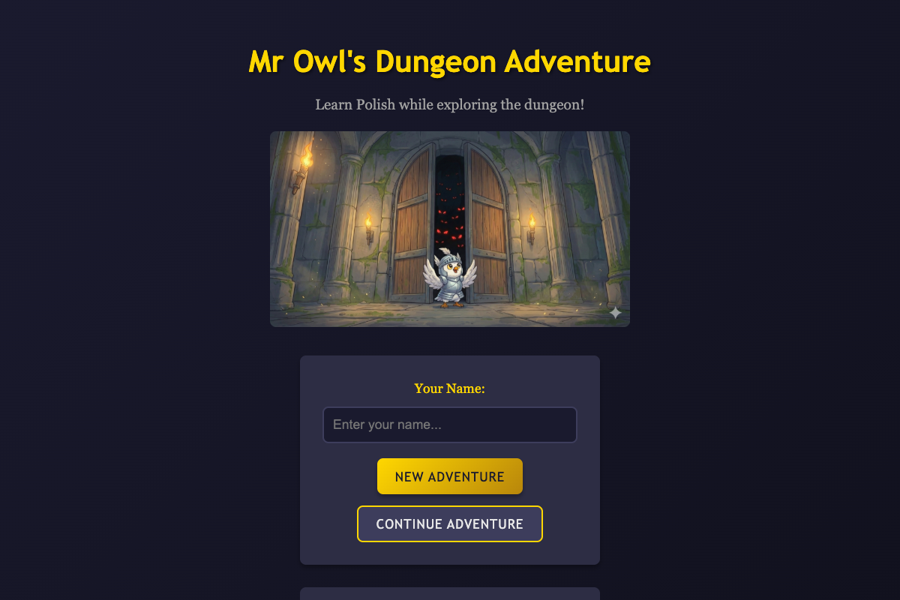
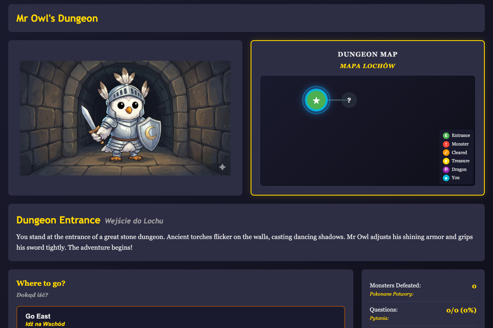
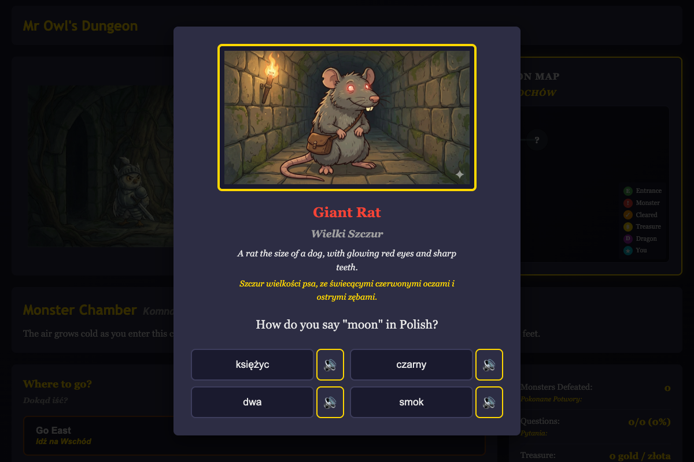
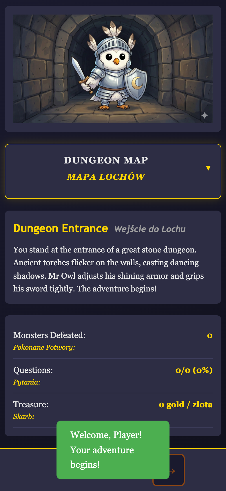
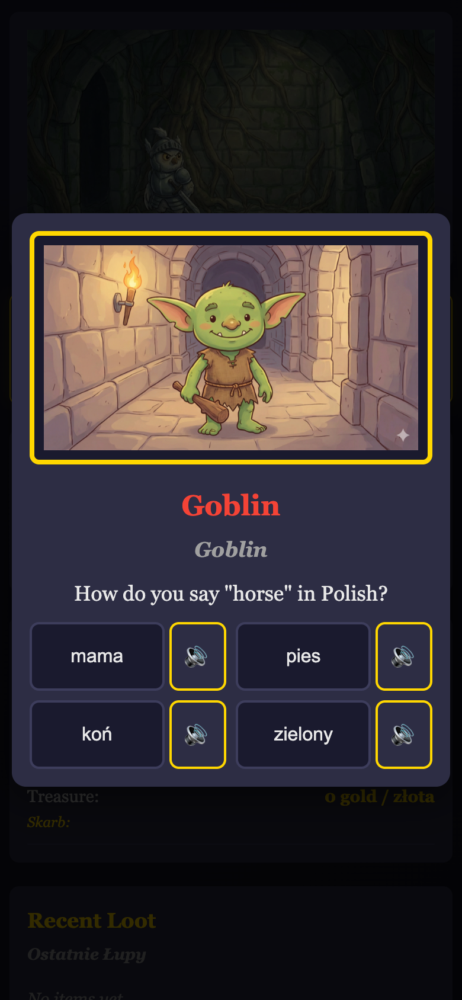

# Mr Owl's Dungeon Adventure

A Polish language learning game for kids, disguised as a dungeon crawler. Explore a procedurally generated dungeon as Mr Owl the Knight, defeat monsters by answering Polish vocabulary and grammar questions, and battle a dragon boss to win.

Runs in the browser, on Android, and on iOS.

<p align="center">
  
</p>

## How It Works

You navigate through a dungeon full of monsters. Each monster encounter presents a Polish language quiz — answer correctly to defeat the monster and collect loot, answer incorrectly and you get pushed back. The dungeon map reveals itself as you explore, leading you toward the dragon boss at the deepest point.

The dragon requires **3 correct answers in a row** to defeat. One wrong answer resets your streak and sends you back.

### Exploring the Dungeon

The game screen shows your current room, an interactive dungeon map, and navigation options. The map uses fog-of-war — only rooms you've visited (and their neighbors) are visible.

<p align="center">
  
</p>

### Combat

When you enter a room with a monster, a quiz appears. Questions cover Polish vocabulary and grammar at three difficulty levels, scaling with dungeon depth.

<p align="center">
  
</p>

### Mobile

The game is fully responsive and runs as a native app on Android and iOS via Capacitor, with touch navigation, swipe gestures, haptic feedback, and native text-to-speech for Polish pronunciation.

<p align="center">
  
  &nbsp;&nbsp;
  
  &nbsp;&nbsp;
  
</p>

## Getting Started

### Browser

```bash
npm start
```

Or open `www/index.html` directly in a browser. No build step required.

### Android

Requires Java 17+:

```bash
export JAVA_HOME=/usr/local/opt/openjdk@21/libexec/openjdk.jdk/Contents/Home
npm run android:run
```

### iOS (macOS only)

```bash
npm run ios:run
```

## Running Tests

```bash
npm test
```

170+ unit tests covering dungeon generation, combat mechanics, question selection, save/load, and more.

## Project Structure

```
www/               Game source (HTML, CSS, vanilla JS)
├── js/modules/    Core game logic (dungeon, combat, player, UI, ...)
├── js/adapters/   Platform abstraction (storage, audio, input)
├── js/data/       Polish vocabulary & grammar question banks
└── assets/        Character and monster artwork
android/           Capacitor Android project
ios/               Capacitor iOS project
tests/             Unit and E2E test suites
```

See [docs/ARCHITECTURE.md](docs/ARCHITECTURE.md) for a detailed technical overview.

## License

MIT
