# Mr Owl's Dungeon Adventure

A Polish language learning game for kids, disguised as a dungeon crawler. Explore a procedurally generated dungeon as Mr Owl the Knight, defeat monsters by answering Polish vocabulary and grammar questions, and battle a dragon boss to win.

Runs in the browser, on Android, and on iOS.

<p align="center">
  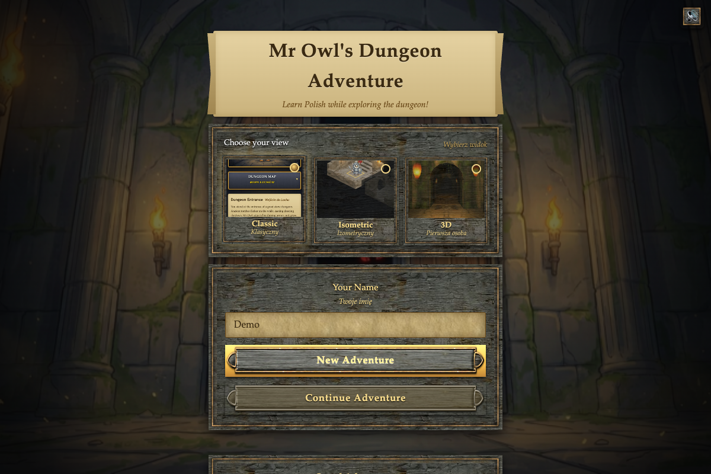
</p>

## How It Works

You navigate through a dungeon full of monsters. Each monster encounter presents a Polish language quiz — answer correctly to defeat the monster and collect loot, answer incorrectly and you get pushed back. The dungeon map reveals itself as you explore, leading you toward the dragon boss at the deepest point.

The dragon requires **3 correct answers in a row** to defeat. One wrong answer resets your streak and sends you back.

### Exploring the Dungeon

The game screen shows your current room, an interactive dungeon map, and navigation options. The map uses fog-of-war — only rooms you've visited (and their neighbors) are visible.

<p align="center">
  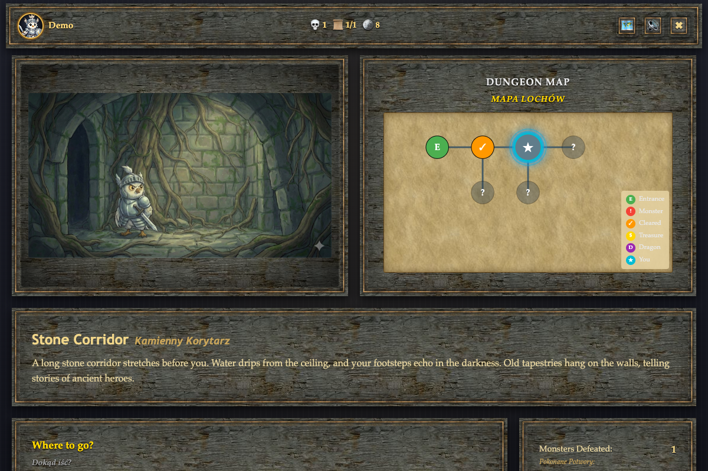
</p>

### Combat

When you enter a room with a monster, a quiz appears. Questions cover Polish vocabulary and grammar at three difficulty levels, scaling with dungeon depth.

<p align="center">
  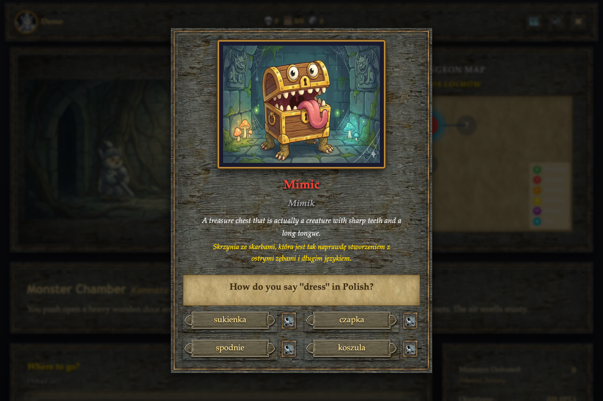
</p>

### Launch Screen and Views

The launch screen lets you pick how the dungeon is shown: **Classic**, **Isometric** or **3D** (first-person). Picking a card only remembers the choice; the run starts with "New Adventure" or "Continue Adventure". Saves are shared between views, so a run started in one view can be continued in another.

### Sound and Effects

Encounters have synthesized sound effects (Web Audio, no audio files), answer and monster animations, and haptic feedback on phones. After each answer the result screen reads the completed sentence or the Polish word aloud. The launch screen plays a looping theme (`www/assets/music/start-theme.mp3`; see [docs/music-generation.md](docs/music-generation.md) for how it was produced and which generators allow commercial use). The speaker button mutes sounds and music; the choice is remembered. Animations respect the system "reduce motion" setting.

### Mobile

The game is fully responsive and runs as a native app on Android and iOS via Capacitor, with touch navigation, swipe gestures, haptic feedback, and native text-to-speech for Polish pronunciation.

<p align="center">
  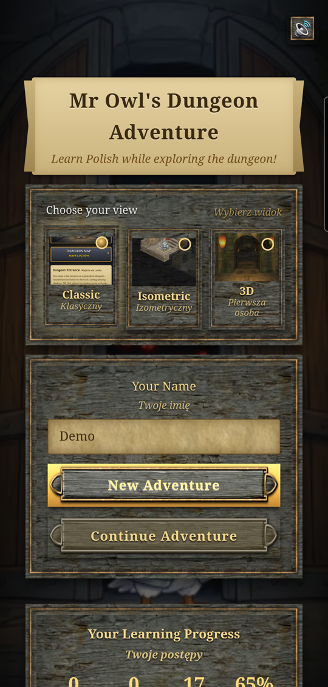
  &nbsp;&nbsp;
  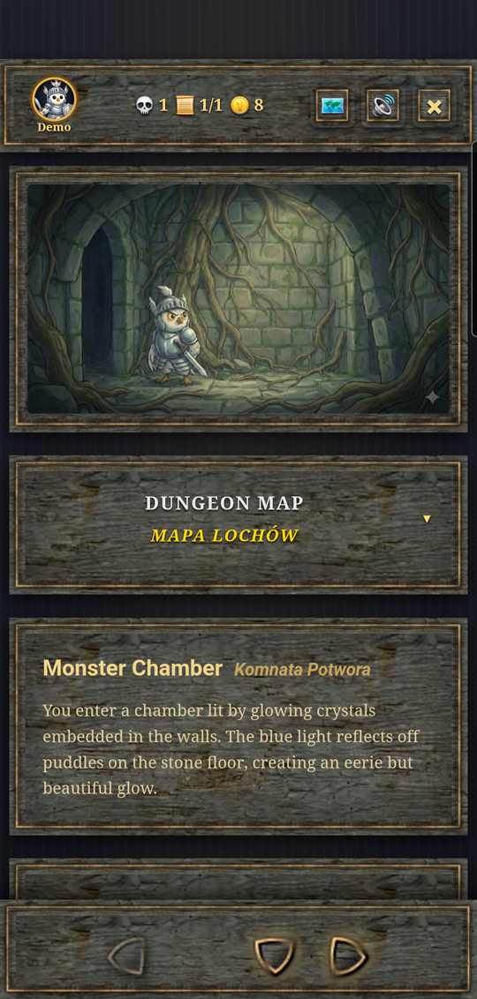
  &nbsp;&nbsp;
  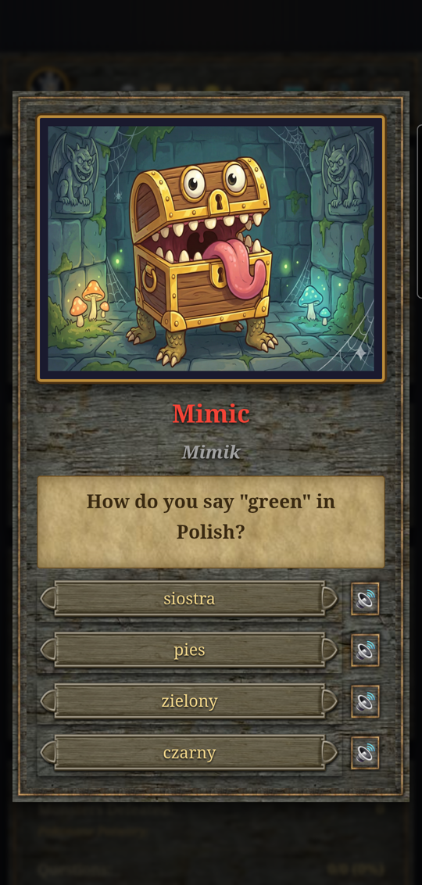
</p>

## Getting Started

### Browser

```bash
npm start
```

Or open `www/index.html` directly in a browser. No build step required.

### Android

Requires Java 17+:

```bash
export JAVA_HOME=/usr/local/opt/openjdk@21/libexec/openjdk.jdk/Contents/Home
npm run android:run
```

### iOS (macOS only)

```bash
npm run ios:run
```

## Prototype Views

Two experimental presentations of the same dungeon live under `www/proto/` and are launched from the view selector on the start screen. They reuse the game modules, modals and saves (autosave after every room), so runs move freely between views.

| Page | Engine | What it shows |
|------|--------|---------------|
| `proto/first-person.html` | three.js (r162, WebGL 1/2) | Eye-of-the-Beholder style stone chambers with rounded corners, floor coves, vaulted ceilings and arched, coved passages, lit by real torch lights with shadows, plus lava rivers: turn left/right, step forward/back; monsters stay hidden in the fog until you enter their chamber. The camera starts in third person over Mr Owl's shoulder; the **1P/3P** dock button switches between that and first person. It shows a rigged 3D Mr Owl (generated from the illustration with Microsoft TRELLIS, animated in Blender, see `tools/owl3d/`) who walks, flaps his wings when knocked back and swings his sword on a correct answer. The nine level-1 monsters are 3D models too (TRELLIS, see `tools/monsters3d/`): they breathe, hover or sway, recoil from a correct answer and lunge at a wrong one. |
| `proto/isometric.html` | Phaser 3.90 (WebGL, Canvas fallback) | Isometric dungeon with fog of war and dressed chambers (torches, banners, water and lava pools, glowing mushrooms, ferns, owl statues, cave-ins, broken floors): unexplored rooms are dark and neighbours dimmed; a chamber's monster, treasure or emptiness only shows once Mr Owl enters it. Tap an adjacent room and Mr Owl walks there; he is pre-rendered from the rigged 3D model (`tools/owl3d/render_iso.py` + `pack_sprites.py`, walk and idle facing toward and away from the viewer). Wall torches are a Blender model (`tools/iso/render_torch.py`) with an 8-frame flame and a warm pool of light on the floor; Mr Owl, monsters, chests and obstacles cast soft shadows away from the torches of their chamber (Mr Owl's follow him every frame, and he darkens between torches). |

Both pages are built for phones: the engine canvas fills the screen and a 1990s-style HUD (stone-and-gold top bar with portrait and stats, framed minimap, parchment room ribbon, control dock) floats above it. In the isometric scene monsters appear as extracted sprites (`www/assets/proto/monsters/`, produced by `tools/extract-sprites.py`), in the 3D scene the level-1 monsters are 3D models and the rest use those sprites as billboards; the encounter screens keep the full painted illustrations.

Gameplay on a phone (Samsung Galaxy S25 Ultra), 3D view with the third-person camera:

<p align="center">
  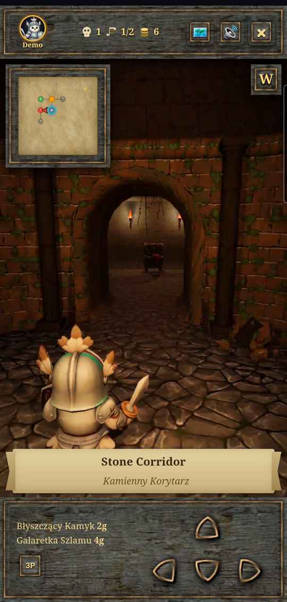
  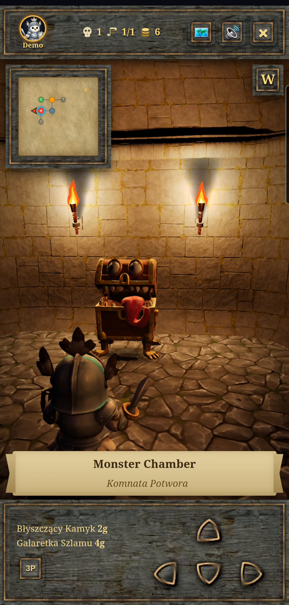
  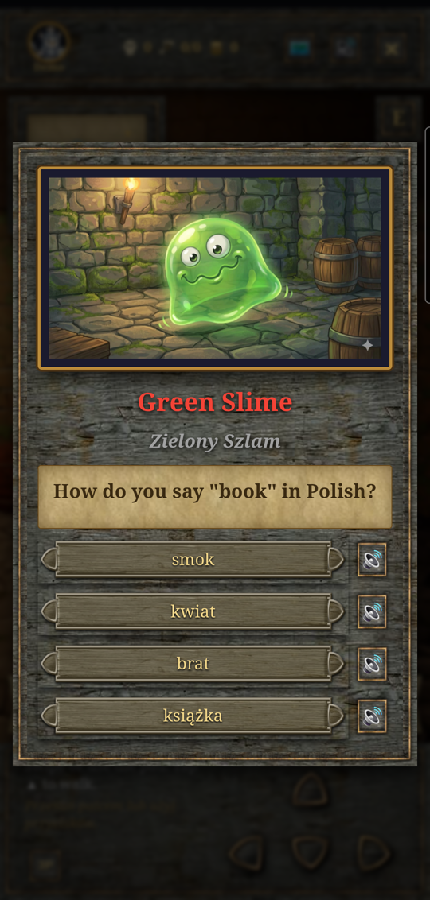
  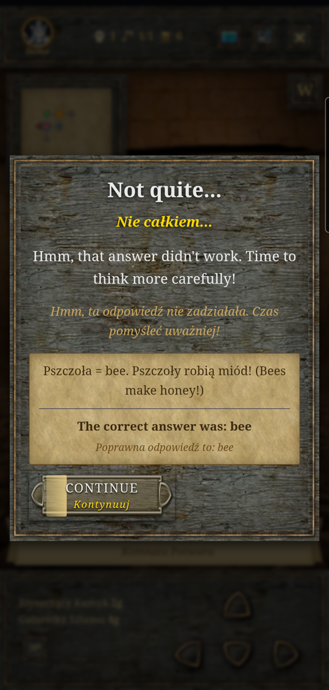
</p>

Isometric view:

<p align="center">
  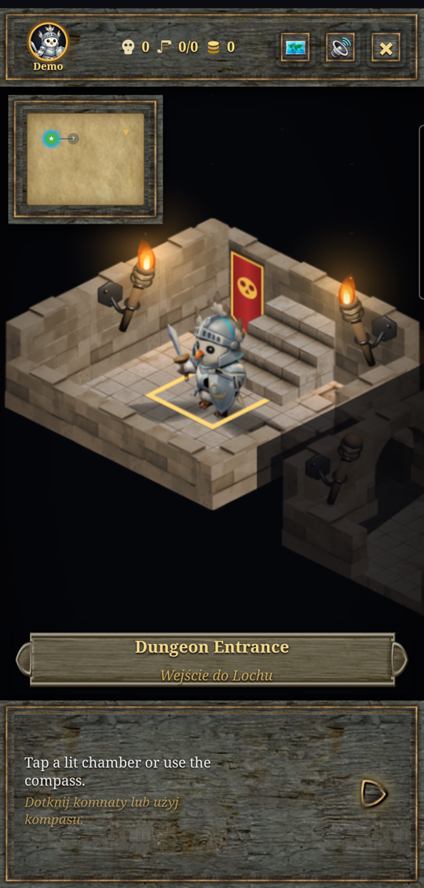
  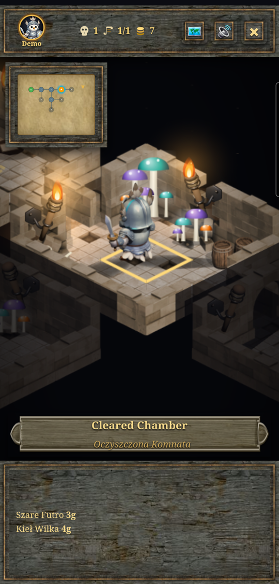
  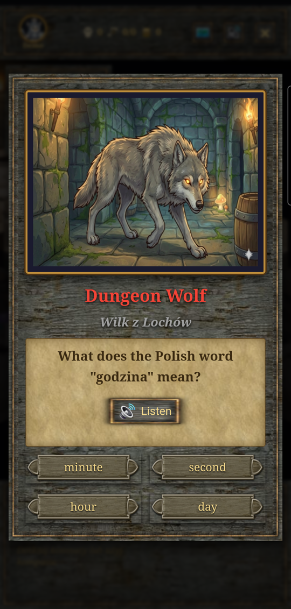
  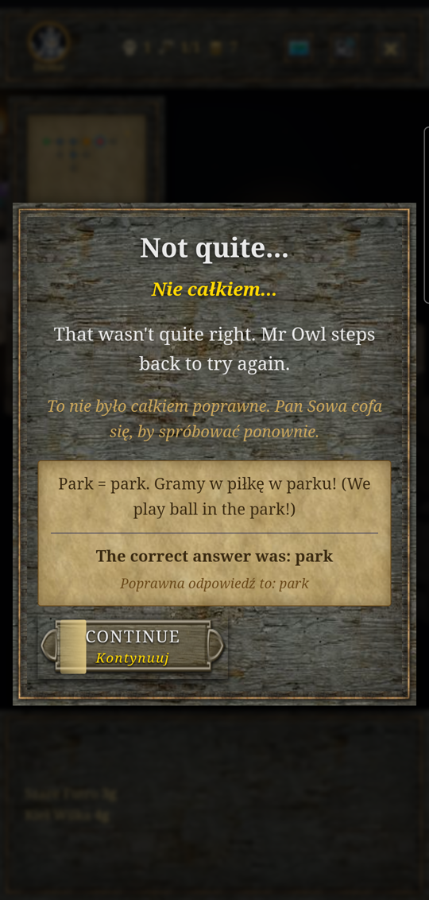
</p>

45-second play recordings with sound: [3D view](docs/videos/3d-play.mp4) and [isometric view](docs/videos/iso-play.mp4).

Run them from an http server (canvas image processing is blocked on `file://`):

```bash
npm run proto        # serves www/ on http://localhost:8080
# open http://localhost:8080/proto/first-person.html or /proto/isometric.html
```

The first-person view uses stylised CC0 stone, brick, flagstone, wood and lava textures from 3dtextures.me (colour + normal maps, credits in `www/assets/proto/fp/LICENSE.md`), with procedural fallbacks. Each chamber has two wall torches (iron bracket, wooden handle, soot plume, animated shader flame) that stay dark until you walk in and then catch one after another; a pool of point lights follows the torches nearest the player (fading between torches rather than popping), and those in the current chamber cast shadows (walls, props, gate bars and monster silhouettes). Chambers are dressed from a deterministic plan (`FpLayout`, built by `FpProps`): corner rubble, half-broken owl and gargoyle statues, skeletons, dropped armour, fallen columns, glowing rune inscriptions, water trickling from wall cracks into puddles that reflect the torches, lava rivers with irregular crusted banks, doorway frames (arch stones, timber, pillars) and wooden doors that creak open as you pass. A synthesized soundscape (`FpAmbience`) rumbles and bubbles near lava and trickles and drips near water. Shadow maps only refresh when the lit set changes. The view always renders at `high` quality (4 shadow-casting torches, 512 px maps, up to 2x pixel ratio); `?quality=low|medium` is kept for debugging. The isometric view's tiles and props are drawn procedurally from the existing artwork's palette. Real art files can be dropped into `www/assets/proto/` (see [docs/art-prompts.md](docs/art-prompts.md) for the file list and generation prompts, and [docs/asset-libraries.md](docs/asset-libraries.md) for a survey of open-source medieval art packs and their licences). The engine bundles are vendored into `www/js/lib/`; rebuild them with `npm run vendor`.

## Third-party assets

| Asset | Author / licence | Used for |
|-------|------------------|----------|
| [Isometric Miniature Dungeon](https://kenney.nl/assets/isometric-miniature-dungeon) | Kenney, CC0 | Floors, walls, archways, stairs, chests and props (barrels, broken table, timber supports, holed walls) in the isometric view (`www/assets/proto/iso/kenney/`, downscaled to 128x256). The pack has no statues, water, lava, mushrooms or plants, so those decor pieces are painted procedurally in `js/proto/iso-textures.js` |
| [RPG Audio](https://kenney.nl/assets/rpg-audio) | Kenney, CC0 | Footsteps, clicks, doors, coins and hit clips in the isometric view (`www/assets/audio/kenney/`, converted to mp3) |
| [RPG GUI construction kit v1.0](https://opengameart.org/content/rpg-gui-construction-kit-v10) | Lamoot, CC-BY 3.0 | Wooden panels, bronze frames, bars and arrow buttons of the isometric view's HUD and modals (`www/assets/proto/ui/rpggui/`, pieces cropped from the sheet; credited on the launch screen) |

Kenney's packs are CC0 (no attribution required); Lamoot's kit is CC-BY and is credited on the launch screen. Licence texts ship next to the files. The start-screen theme's provenance is documented in `www/assets/music/README.md`.

## Running Tests

```bash
npm test
```

270+ unit tests covering dungeon generation, combat mechanics, question selection, save/load, and more.

## Project Structure

```
www/               Game source (HTML, CSS, vanilla JS)
├── js/modules/    Core game logic (dungeon, combat, player, UI, sfx, fx, ...)
├── js/proto/      Prototype view modules (first-person, isometric)
├── proto/         Standalone prototype pages
├── js/lib/        Vendored libraries (maze generator, three.js, Phaser)
├── js/adapters/   Platform abstraction (storage, audio, input)
├── js/data/       Polish vocabulary & grammar question banks
└── assets/        Character and monster artwork
android/           Capacitor Android project
ios/               Capacitor iOS project
tests/             Unit and E2E test suites
```

See [docs/ARCHITECTURE.md](docs/ARCHITECTURE.md) for a detailed technical overview.

## License

MIT
