# Mr Owl's Dungeon Adventure

A Polish language learning game for kids, disguised as an adventure. Mr Owl the Knight walks a haunted Halloween cemetery or a dragon's dungeon, and every monster he meets is beaten with Polish: vocabulary and grammar questions, word-matching boards and sentences built from word tiles.

Runs in the browser, on Android and on iOS (Capacitor). Three views share the same game, questions and saves: **Isometric** (the main one, with two levels), **3D** and **Classic**.

<p align="center">
  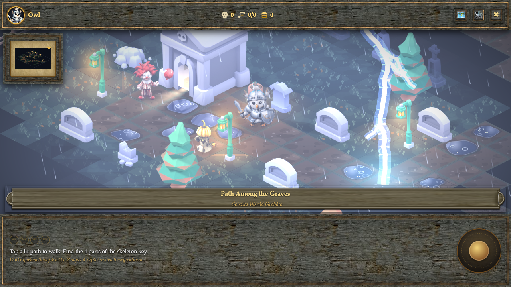
</p>

**Play the Halloween Cemetery in your browser: https://lukmusial.github.io/knight-owl/** (works on phones too; see [Play Online](#play-online)).

## Halloween Cemetery (isometric view)

The featured level. A moonlit graveyard inside a picket fence is generated from a seed: lanes two and three tiles wide wind between graves, dead trees, benches, statues, pumpkins and lamp posts; four small crypts sit one per quarter and the great tomb lies farthest from the gate.

<p align="center">
  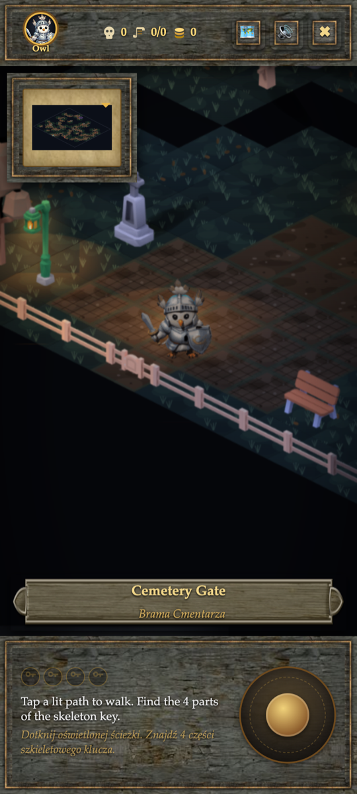
  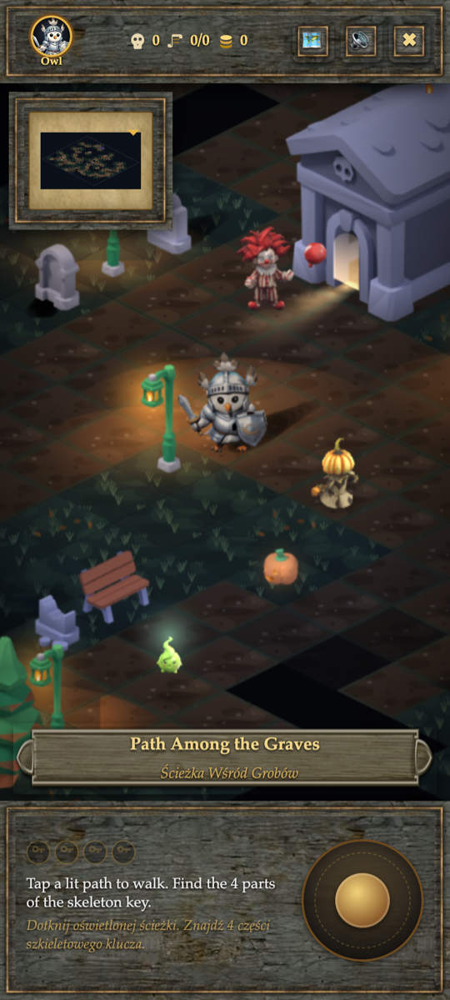
  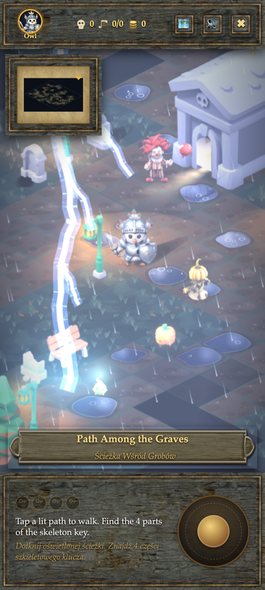
</p>

- **Walking.** Mr Owl moves freely: push the thumb-stick in the dock, drag anywhere on the map or use the arrow keys; tapping a lit path sends him there on his own. The camera follows him.
- **The night.** The grounds are dark. A soft light opens around Mr Owl and around each lamp post as he walks, ground he has walked near stays dimly remembered, and nothing pops into view: graves, crypts and monsters fade up out of the dark as he approaches.
- **Weather.** Showers come and go on a seeded schedule. Lightning announces each one, then strikes the lit ground near Mr Owl while it rains, with a flash, a shaking camera and thunder that comes later the farther away the strike is. Puddles fill on the lanes, raindrops ring in them, they mirror the graves, lanterns and monsters standing by them, Mr Owl splashes through them, and they dry out after the rain.
- **Monsters.** Skeletons, ghosts, zombies, lost souls, banshees, the pumpkin man, spiders, bats, rats and will-o'-the-wisps patrol the lanes, each with its own walk (shamble, hover, flap, skitter, scurry), and lunge at Mr Owl when they reach him. They are 3D models rendered in five facings, so they turn the way they walk. A correct answer makes the monster fade, sink or run off and leave its loot; a wrong one sends Mr Owl back to the gate.
- **The skeleton key.** Each small crypt's door light shows what is left to do: gold while its guardian still holds a part of the key, blue once Mr Owl has it. With all four parts the chained door of the great tomb opens and the **Grim Reaper** rises from it. He needs three right answers in a row; beating him plays a defeat scene on the map (a purple blaze, his captured souls drifting off as wisps) and ends the level.
- **Music.** A quiet nocturne after Solveig's Song plays while you explore and a dark carnival waltz during the Reaper fight (`?music=` picks another of eight tracks or `none`).

<p align="center">
  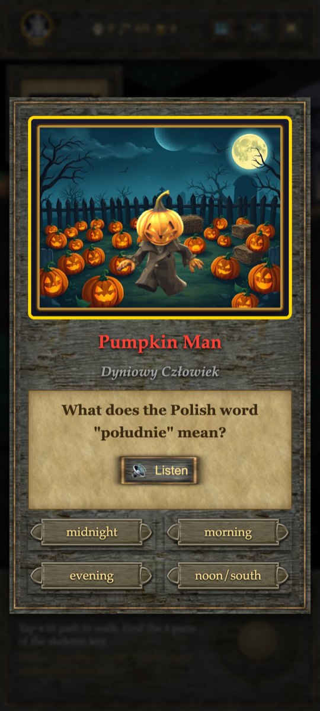
  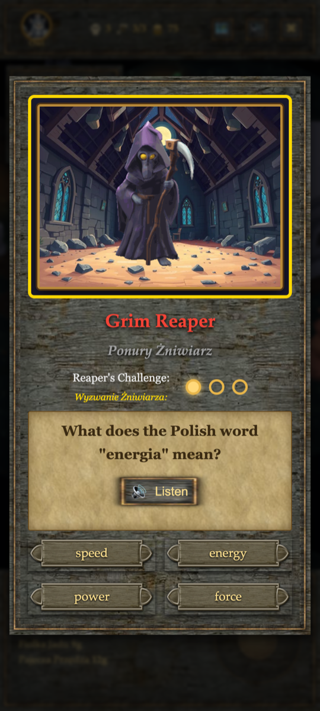
  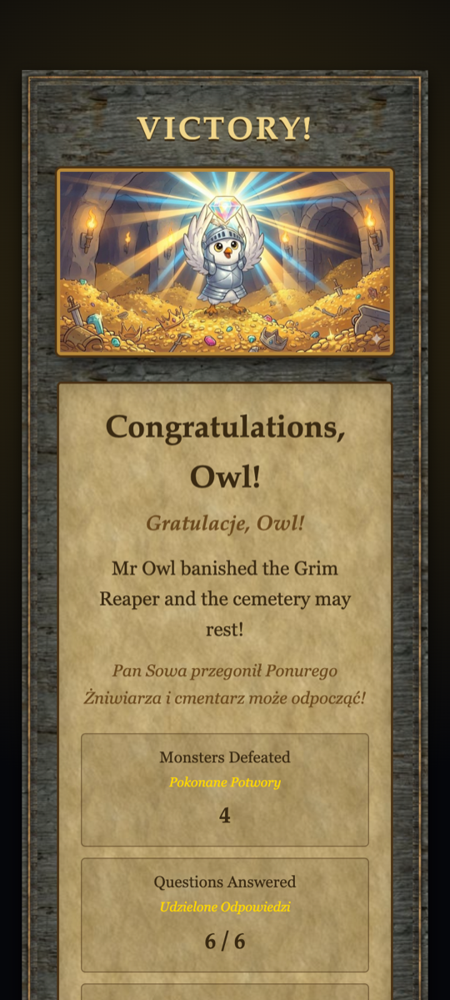
</p>

Videos: [the whole level, gate to Grim Reaper](docs/videos/cemetery-playthrough.mp4) and [the weather in one take](docs/videos/cemetery-weather.mp4) (the night reveal, the storm announcing the rain, puddles filling, lightning over the wet ground); also [the rain](docs/videos/cemetery-rain.mp4), [the storm](docs/videos/cemetery-storm.mp4) and [the night reveal](docs/videos/cemetery-reveal.mp4) alone, and [a phone recording](docs/videos/phone-iso-play.mp4).

## Encounters

Every encounter opens a card with the monster standing on a painted room (picked for the level and the kind of monster). The character is an animated sprite sheet: it turns round to meet the player, squares up before a reaction, lunges at a wrong answer, and turns and walks away when beaten. After each answer the result card reads the Polish word or the whole sentence aloud.

<p align="center">
  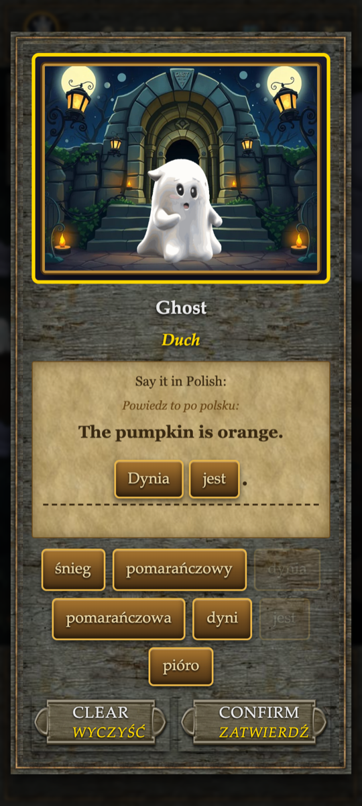
  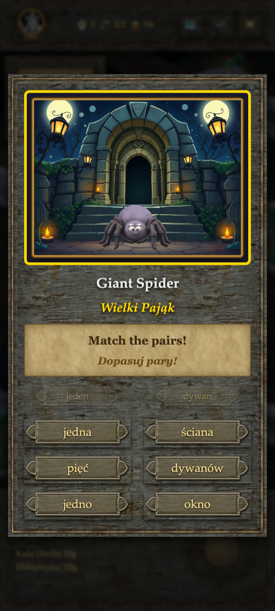
</p>

- **Quiz**: a Polish vocabulary or grammar question with four answers, at three difficulty levels.
- **Matching board**: pair English and Polish words (or pronouns and their forms).
- **Sentence builder**: build the Polish sentence for an English prompt from word tiles, tapping or dragging them into place. Wrong forms and look-alike words (*lasem* / *lisem*) are among the tiles. Every accepted word order counts, and a near miss marks the faulty tiles and allows one fix-up.
- **Bosses** (the Grim Reaper and the dragon) need three correct answers in a row; a wrong one resets the streak and pushes Mr Owl back.

## The Dungeon

The second level, playable in all three views: a procedurally generated maze of chambers with fog of war, monsters getting harder the deeper you go, treasure, and the dragon on its hoard in the deepest chamber.

**Isometric view**: torch-lit chambers dressed with banners, water and lava pools, mushrooms, statues and cave-ins; a chamber's monster or treasure only shows once Mr Owl enters it. Tap a neighbouring room and he walks there.

<p align="center">
  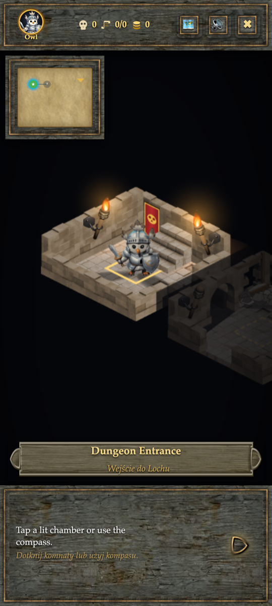
  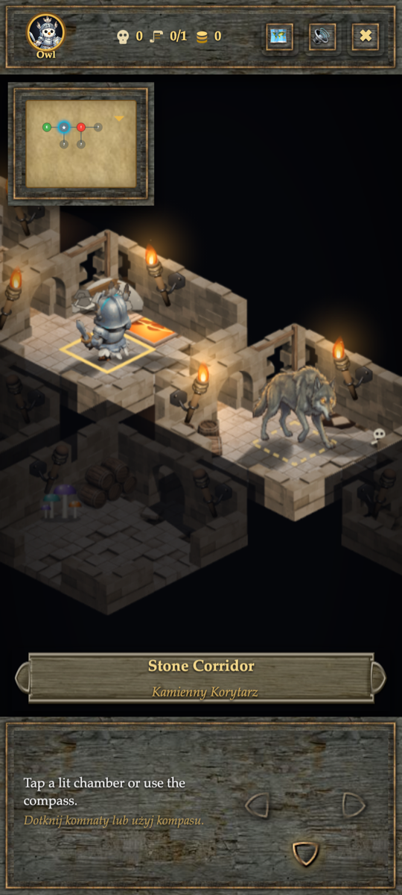
  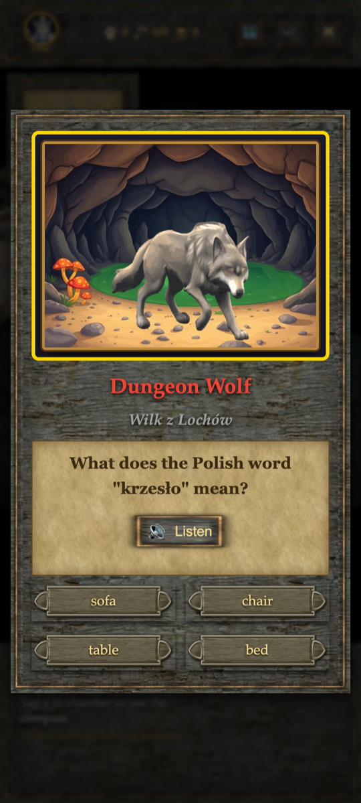
</p>

**3D view** (three.js): Eye-of-the-Beholder style stone chambers with vaulted ceilings, arched passages, lava rivers and wall torches that cast real shadows, seen over Mr Owl's shoulder or in first person (the **1P/3P** button). Mr Owl and every monster are rigged or animated 3D models: they breathe, hover or sway, recoil from a correct answer and lunge at a wrong one.

<p align="center">
  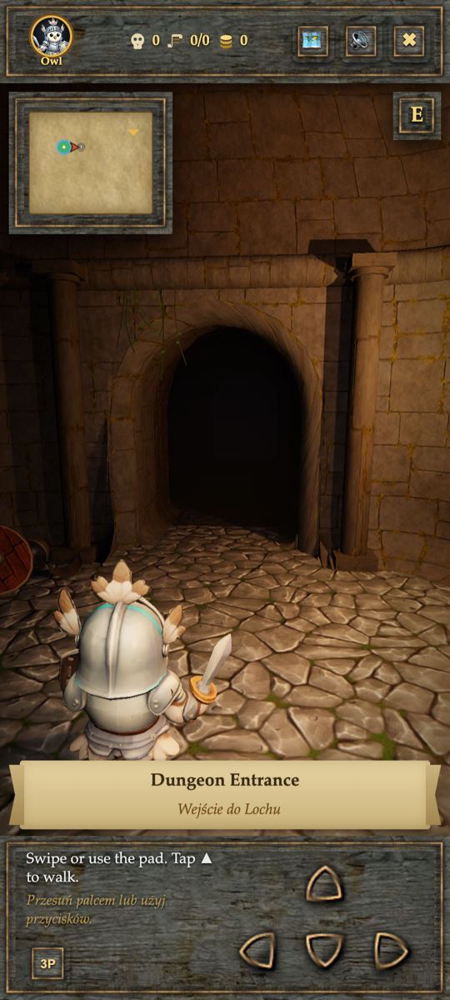
  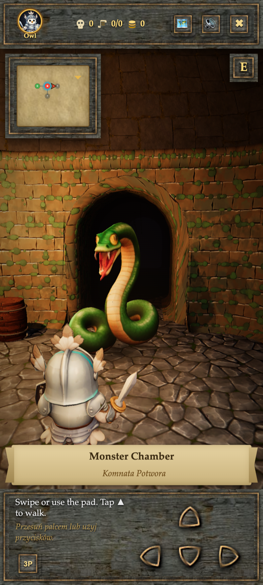
  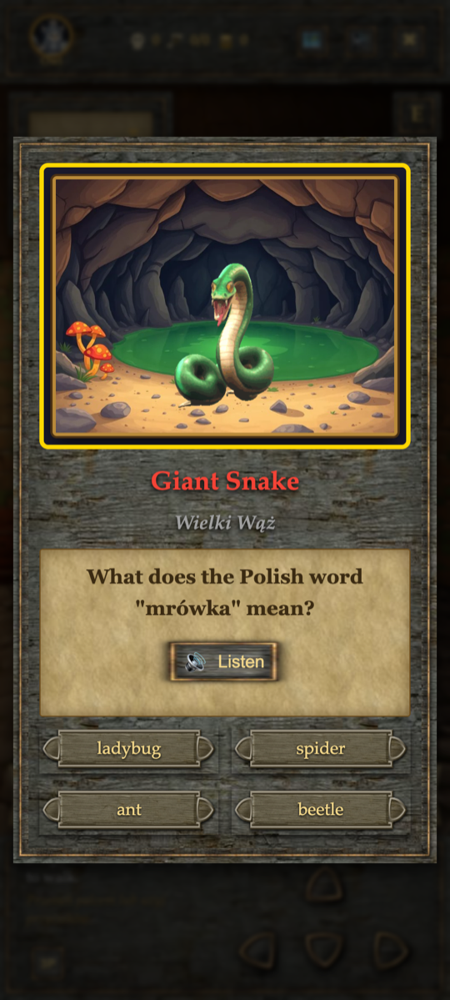
</p>

**Classic view**: the original page, with each room's painting, an SVG map of the dungeon and compass navigation. Its launch screen is where you pick the view; saves are shared, so a run started in one view can be continued in another (a cemetery run always continues in the isometric view).

<p align="center">
  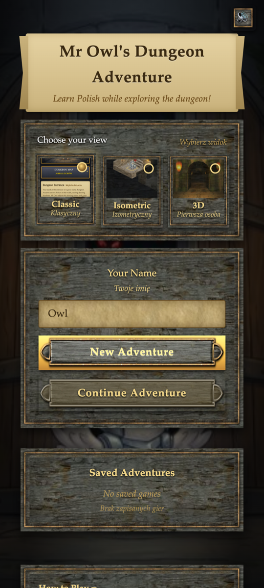
  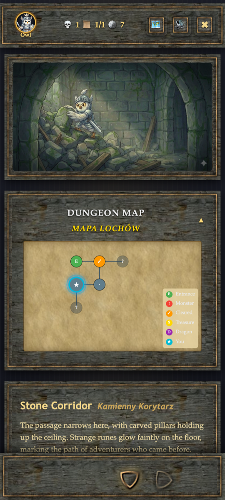
</p>

Dragon runs on video: [isometric](docs/videos/iso-dragon.mp4), [3D](docs/videos/3d-dragon.mp4), [classic](docs/videos/classic-dragon.mp4); also [a minute of exploring in 3D](docs/videos/3d-explore.mp4) and 45-second clips with sound of the [3D](docs/videos/3d-play.mp4) and [isometric](docs/videos/iso-play.mp4) views.

## Sound, Effects and Phones

Sound effects are synthesized with Web Audio (plus Kenney's CC0 footsteps and clicks in the isometric view), with answer and monster animations and haptic feedback on phones. Polish words are spoken by the Web Speech API in the browser and by native text-to-speech in the apps. The speaker button mutes sound and music, and animations respect the system "reduce motion" setting. Every screen is built for phones: the game fills the screen and a stone-and-gold HUD (portrait and stats, framed minimap, room ribbon, control dock) floats above it; the apps pause the game, music and speech when sent to the background.

## Play Online

The Halloween Cemetery is published on GitHub Pages as a game of its own, the isometric view and the cemetery only: **https://lukmusial.github.io/knight-owl/**. It opens on a start page where you type your name and start a new adventure or continue one; progress is saved in the browser as you play.

<p align="center">
  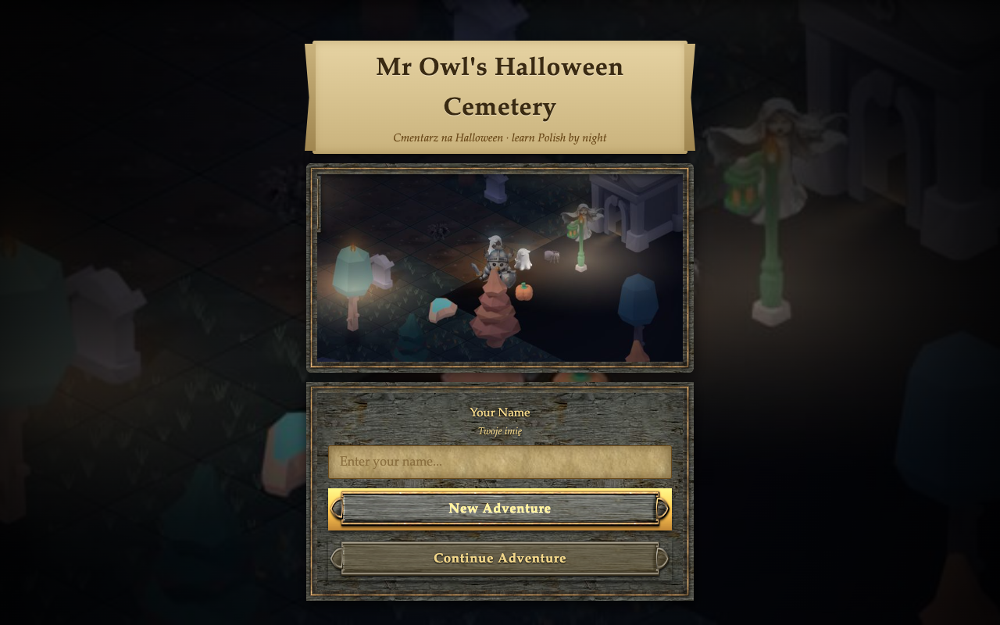
</p>

The site is built from `www/` by `tools/pages/build.js` and deployed by `.github/workflows/pages.yml` on every push to `main` that touches `www/` (the repository's Pages source is set to *GitHub Actions*). The build leaves out what only the 3D and classic views use (36 MB instead of 62 MB), serves `www/halloween.html` as the start page and locks the isometric page to the cemetery, so neither the level picker nor the dungeon can be reached.

```bash
npm run pages:build   # writes dist/pages/
npm run pages:serve   # builds and serves it on http://localhost:8090
npm run test:pages    # builds it and plays the level through in headless Chrome, failing on any missing file
```

## Getting Started

### Browser

The isometric and 3D views need an http server (canvas image processing is blocked on `file://`):

```bash
npm run proto        # serves www/ on http://localhost:8080
```

Then open http://localhost:8080/ for the launch screen (pick a view, then New Adventure), or go straight to http://localhost:8080/isometric.html?level=cemetery or /first-person.html. No build step is needed: the game is vanilla JavaScript. The engine bundles (three.js, Phaser 3) are vendored into `www/js/lib/`; rebuild them with `npm run vendor`.

### Android

Requires Java 17+:

```bash
export JAVA_HOME=/usr/local/opt/openjdk@21/libexec/openjdk.jdk/Contents/Home
npm run android:run
```

### iOS (macOS only)

```bash
npm run ios:run
```

## Running Tests

```bash
npm test
```

500+ unit tests in node: cemetery and dungeon generation, the night reveal, rain and storm schedules, combat, question, matching and sentence logic, save/load and more. Headless Chrome checks (they need Google Chrome; `puppeteer-core`) play the real pages:

| Command | What it checks |
|---------|----------------|
| `npm run test:cem` | Plays the whole cemetery: walking, losing, a guardian, the key, the Reaper, victory, continuing a save |
| `npm run test:pages` | The same on the GitHub Pages build, plus the start page and the cemetery lock |
| `npm run test:cem:perf` | Frame time, draw calls, texture memory and the ground chunk pool on a long walk |
| `npm run test:cem:reveal` / `:defeat` / `:rain` / `:storm` | Nothing pops out of the dark; beaten monsters never reappear; puddles, mirrors and splashes; lightning cost and pausing |
| `npm run test:card` / `test:sentence` | Encounter card rooms and animations; the sentence builder with mouse and touch |
| `npm run test:fp:perf` | The 3D view keeps a single render loop |
| `npm run shots:readme` | Retakes every screenshot in this README |

`npm run record:cem`, `record:cem:weather`, `record:iso`, `record:fp` and the other `record:*` scripts make the videos above. Performance numbers and how to re-measure them are in [docs/performance-baseline.md](docs/performance-baseline.md).

## How It Was Made

- **Mr Owl and the monsters** were generated from their illustrations as 3D models with Microsoft TRELLIS, rigged and animated in Blender (`tools/owl3d/`, `tools/monsters3d/`), and rendered as sprite sheets for the isometric view and the encounter cards. The illustrations and painted card rooms come from FLUX.1-schnell (`tools/art/`).
- **The cemetery props** are Kenney's Graveyard and Nature kits rendered in Blender at the isometric 2:1 angle (`tools/iso/render_kit.py`); the ground and webs are painted procedurally.
- **The music** was generated with ACE-Step (Apache-2.0) via `tools/music/generate_loop.py`; see [docs/music-generation.md](docs/music-generation.md).
- **The 3D view** uses stylised CC0 stone, brick, wood and lava textures from 3dtextures.me (credits in `www/assets/proto/fp/LICENSE.md`).

## Third-party Assets

| Asset | Author / licence | Used for |
|-------|------------------|----------|
| [Graveyard Kit](https://kenney.nl/assets/graveyard-kit), [Nature Kit](https://kenney.nl/assets/nature-kit) | Kenney, CC0 | Gravestones, crypts, lamp posts, pumpkins, benches, fence and gate, trees of the cemetery (`www/assets/proto/iso/cemetery/`) |
| [Isometric Miniature Dungeon](https://kenney.nl/assets/isometric-miniature-dungeon) | Kenney, CC0 | Floors, walls, archways, chests and props of the isometric dungeon (`www/assets/proto/iso/kenney/`) |
| [RPG Audio](https://kenney.nl/assets/rpg-audio) | Kenney, CC0 | Footsteps, clicks, doors, coins and hits in the isometric view (`www/assets/audio/kenney/`) |
| [RPG GUI construction kit v1.0](https://opengameart.org/content/rpg-gui-construction-kit-v10) | Lamoot, CC-BY 3.0 | Wooden panels, frames, bars and buttons of the HUD and cards (`www/assets/proto/ui/rpggui/`; credited on the launch screens) |
| Textures from [3dtextures.me](https://3dtextures.me) | CC0 | Stone, brick, flagstone, wood and lava in the 3D view (`www/assets/proto/fp/`) |

Licence texts ship next to the files. The start-screen theme's provenance is in `www/assets/music/README.md`.

## Project Structure

```
www/               Game source (HTML, CSS, vanilla JS)
├── index.html     Launch screen and the classic view
├── isometric.html The isometric view (the cemetery and the dungeon)
├── first-person.html The 3D view
├── halloween.html Start page of the stand-alone Halloween Cemetery site
├── js/modules/    Core game logic (dungeon, combat, questions, sentences, player, UI, sfx, ...)
├── js/proto/      Isometric (iso-*, cem-*) and 3D (fp-*) view modules (the folder name is historical)
├── js/lib/        Vendored libraries (maze generator, three.js, Phaser)
├── js/adapters/   Platform abstraction (storage, audio, input)
├── js/data/       Polish vocabulary, grammar, matching and sentence banks, monsters
└── assets/        Art, sprite sheets, 3D models, music and sounds
tools/             Asset pipelines (3D, art, music), headless checks, the Pages build
android/, ios/     Capacitor projects
tests/             Unit and E2E test suites
```

See [docs/ARCHITECTURE.md](docs/ARCHITECTURE.md) for a technical overview and [CLAUDE.md](CLAUDE.md) for the details of each module.

## License

MIT
